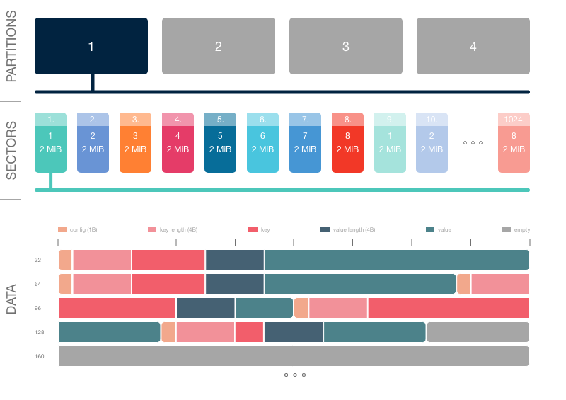

# KKV

## Developing

### Build

```bash
sh build_example_test.sh
```

### Code style

While coding please follow the [Google C++ Style Guide](https://google.github.io/styleguide/cppguide.html).

# KKV - Working principle

## Terms

**database**, **db** - Physical directory on a disk which stores all db files
required to right working.

**partition** - Physical file on a disk.

**sector** (**slot**) - A space in a partition.

---

## Numbers

### Partitions

Each partition can be up to 4 GiB.

#### Available numbers of partitions

2, 3, 4, ..., 64

### Sectors

#### Available numbers of sectors

4, 5, 6, ..., 32

#### Available sector sizes

<table>
<thead>
	<tr>
		<th colspan="10" style="text-align: center;">Available sector sizes</th>
	</tr>
</thead>
<tbody>
	<tr>
		<td>4 KiB</td>
		<td>8 KiB</td>
		<td>16 KiB</td>
		<td>32 KiB</td>
		<td>64 KiB</td>
		<td>128 KiB</td>
		<td>256 KiB</td>
		<td>512 KiB</td>
		<td>1 MiB</td>
		<td><b>2 MiB</b></td>
  </tr>
  <tr>
		<td>4 MiB</td>
		<td>8 MiB</td>
		<td>16 MiB</td>
		<td>32 MiB</td>
		<td>64 MiB</td>
		<td>128 MiB</td>
		<td>256 MiB</td>
		<td>512 MiB</td>
		<td>1 GiB</td>
	</tr>
</tbody>
</table>

#### Maximum sector size depending on the number of sectors

| Number of Sectors | Max sector size |
| ----------------- | --------------- |
| 4                 | 1 GiB           |
| 5 - 8             | 512 MiB         |
| 9 - 16            | 256 MiB         |
| 17 - 32           | 128 MiB         |

### Default settings

| Option               | Default value |
| -------------------- | ------------- |
| Number of Partitions | 4             |
| Number of Sectors    | 8             |
| Sector size          | 2 MiB         |


### How the data are storing

This is an example for the [default settings](#default-settings).


